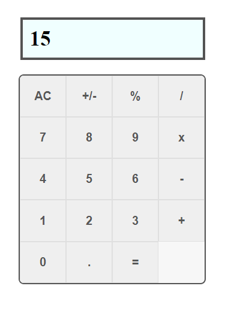

# MATH MAGICIANS - Calculator app

This project is a simple calculator app made mainly with react.

In this project:

- Made a basic jsx body for the calculator.
- Made the logic for calculator.
- Made the neccessary components for react application.

## Live Demo

[LIVE!](https://math-magicians-atef.herokuapp.com/)

## Usage

- Clone the repo "https://github.com/Mohamed-js/math-magicians.git"
- run "npm install"
- run "npm start"

## Technologies

- React
- Create-react-app
- Javascript
- VSCode

## Author

👤 **Mohammed Atef**

- GitHub: [@Mohamed-Atef](https://github.com/Mohamed-js)
- Twitter: [@Mohammed_Atef](https://twitter.com/Demovejetta)
- LinkedIn: [LinkedIn](https://www.linkedin.com/in/mohamed-js/)

## 🤝 Contributing

Contributions, issues, and feature requests are welcome!

## Show your support

Give a ⭐️ if you like this project!

### Acknowledgements

- Microverse
